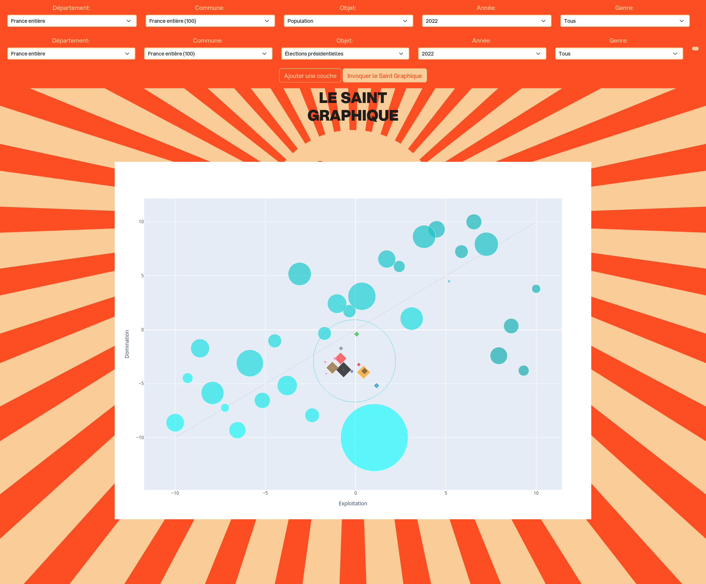

# Le Saint Graphique



[Demo](https://saint-graphique.fedivienne.org/)

## C'est quoi?
Le Saint Graphique est une représentation de la population française, selon les Professions et Catégories Socioprofessionnelles (PCS) distribuées selon deux axes:
- un axe de domination: plus une PCS est haute dans le graphique, plus elle est en position de domination.
- un axe du capital: plus une PCS est à droite dans le graphique, plus ses revenus sont tirés de son capital plutôt que de son travail.

On peut ensuite représenter les électorats sur ce graphique: ils se placent en direction des PCS qui les constituent.

## C'est qui?
Le Saint Graphique a été transmis par un membre de la PaduTeam, Chris, dans [cette vidéo](https://youtu.be/MJsGgEA_Slwsi=IfVK_p2BknLdGFaD).
Vous pouvez consulter les enseignements du Saint Graphique via [cette playlist](https://youtube.com/playlist?list=PLrY3xxT4nd05ZRw9tEIVexgLwZ0taXOzl&si=JzwSmbvosigN3THy).

Nous n'avons aucun lien avec la Paduteam, nous essayons seulement ici de propager leurs évangiles. Leur algorithme n'ayant pas été révélé, nous avons tenté de le reproduire.

## L'algorithme
Pour obtenir les coordonnées dans le graphique de chaque PCS:
* Pour le X:
  1. Patrimoine / Niveau de vie
  2. Classement des PCS de 1 à 30 en fonction du résultat précédent.
  3. Pour normaliser de -10 à 10: -10 + (20 /29) * (30 - Rang obtenu précédemment)
* Pour le Y:
  1. Pour chaque PCS, on calcule un score lié aux diplômes obtenus: 5 * bac+5 + 3 * bac+3 + 2 * bac+2 + bac - cap - 2 * brevet - 3 * certif
  2. Exception pour les retraités: on leur accorde un score de -180.
  3. Classement des PCS de 1 à 30 en fonction du score précédent.
  4. Pour normaliser de -10 à 10: -10 + (20 /29) * (30 - Rang obtenu précédemment)

Pour les coordonnées des candidatures aux élections, on fait le barycentre de leur électorat en se basant sur la composition de leur vote.
Les coordonnées à pondérer sont celles des PCS de niveau 1, et les poids sont les parts de chaque PCS dans leur électorat.

## Auto-héberger le Saint-Graphique

### Architecture

Le Saint-Graphique est composé de deux couches: 
* le backend, une app python chargée du calcul des coordonnées et de la génération du graphique.
* le frontend, un nginx contenant une page html avec du javascript, chargée d'afficher les menus de sélection et le graphique correspondant.

### Docker-compose
Pour auto-héberger le Saint-Graphique, il est recommandé d'utiliser le docker-compose fournit dans le dépôt. Pour cela, assurez-vous d'avoir installé:
* [Git](https://git-scm.com/install/linux)
* [Docker](https://docs.docker.com/engine/install)
* [Docker Compose](https://docs.docker.com/compose/install/linux/#install-using-the-repository)

Puis clonez le dépôt:

```git clone https://github.com/JnthnBS/saint-graphique```

Puis placez-vous dans le dossier du dépôt:

```cd saint-graphique```

Et lancez docker compose:

```docker compose build && docker compose up -d```

Le Saint-Graphique devrait être accessible à l'adresse: [http://localhost:8080](http://localhost:8080)
